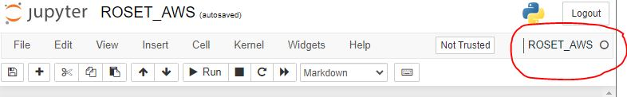

# Getting Started: 
The first step is to identify a folder location where you would like to use the Python Research-Oriented Streamflow Evaluation Tool (ROSET-AWS).
We suggest a location that will be able to easily access streamflow predictions to make for easy evaluation of your model.
Using the command prompt, change your working directory to this folder and git clone [ROSET-AWS](https://github.com/whitelightning450/Community-Streamflow-Evaluation-System)

    git clone https://github.com/whitelightning450/Community-Streamflow-Evaluation-System


## Virtual Environment
It is a best practice to create a virtual environment when starting a new project, as a virtual environment essentially creates an isolated working copy of Python for a particular project. 
I.e., each environment can have its own dependencies or even its own Python versions.
Creating a Python virtual environment is useful if you need different versions of Python or packages for different projects.
Lastly, a virtual environment keeps things tidy, makes sure your main Python installation stays healthy and supports reproducible and open science.

### Creating your ROSET-AWS Python Virtual Environment
Since we will be using Jupyter Notebooks for this exercise, we will use the Anaconda command prompt to create our virtual environment. 
In the command line type: 

    conda create -n ROSET-AWS python=3.9.12

For this example, we will be using Python version 3.9.12, specify this version when setting up your new virtual environment.
After Anaconda finishes setting up your ROSET-AWS, activate it using the activate function.

    conda activate ROSET-AWS

You should now be working in your new ROSET-AWS within the command prompt. 
However, we will want to work in this environment within our Jupyter Notebook and need to create a kernel to connect them.
We begin by installing the **ipykernel** python package:

    pip install --user ipykernel

With the package installed, we can connect the ROSET-AWS to our Python Notebook

    python -m ipykernel install --user --name=ROSET-AWS

Open up the [ROSET-AWS.ipynb](./ROSET-AWS/ROSET_AWS.ipynb) file, click the kernel tab on the top toolbar, and select the ROSET-AWS. 
The ROSET-AWS should show up on the top right of the Jupyter Notebook.




### Loading other Python dependencies
We will now be installing the packages needed to use ROSET-AWS, as well as other tools to accomplish data science tasks.
Enter the following code block in your Anaconda Command Prompt to get the required dependencies with the appropriate versions, note, you must be in the correct working directory:

    pip install -r requirements.txt


## More Contributor information when Cloud Computing

Please visit the eScience [GeoSMART page](https://geosmart.hackweek.io/preliminary/checklist/git.html) and connect your Cloud Computing system using git.


## Creating Stable CONDA Environment

To initiate a virtual environment, follow the following steps:

* Go to home directory
```
cd ~
```
* Create a envs directory
```
mkdir envs
```
* Create .condarc file and link it to a text file
```
touch .condarc

ln -s .condarc condarc.txt
```
* Add the below lines to the condarc.txt file
```
# .condarc
envs_dirs:
 - ~/envs
```
* Restart your server


